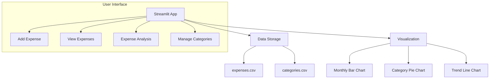

# Personal Expense Tracker


A Streamlit-based web application to track personal expenses with visualization and category management.

## Features

- 📅 Add expenses with date, category, amount, and description
- 📊 View expense history with filtering options
- 📈 Visualize spending patterns with interactive charts
- 🗂️ Manage custom expense categories
- 📁 Export expense data to CSV
- 🥧 Category breakdown with pie charts
- 📆 Monthly and daily spending trends

## Project Structure



## Installation

Clone the repository:

```bash
git clone https://github.com/muzaffar401/Personal_Expense_Tracker.git
cd Personal_Expense_Tracker
```

Install required packages:

```bash
pip install -r requirements.txt
```

Or manually install:

```bash
pip install streamlit pandas matplotlib
```

## Run the application

```bash
streamlit run main
```

## Usage

### Add Expense:

- Select date and category
- Enter amount and optional description
- Click "Save Expense"

### View Expenses:

- Filter by date range and category
- View tabular data
- Export to CSV

### Expense Analysis:

- Monthly spending bar chart
- Category breakdown pie chart
- 30-day spending trend line

### Manage Categories:

- Add new custom categories
- Delete existing categories (except defaults)

## File Structure

```
expense-tracker/
├── app.py                # Main application code
├── expenses.csv          # Expense data storage
├── categories.csv        # Category data storage
├── README.md             # Project documentation
└── requirements.txt      # Dependency list
```

## Requirements

- Python 3.7+
- Streamlit
- Pandas
- Matplotlib

## Future Enhancements

- User authentication
- Budget tracking
- Recurring expenses
- Multi-currency support
- Receipt image upload

## Contributing

Contributions are welcome! Please fork the repository and create a pull request.

## License

MIT License
